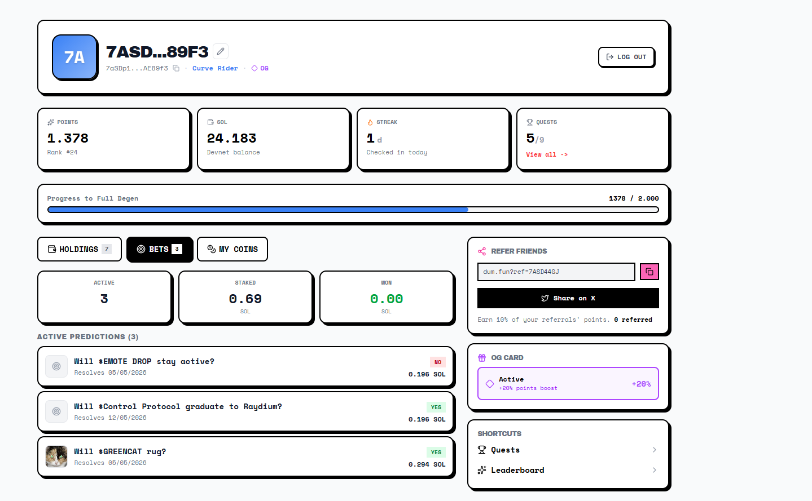

# Dum.fun - Colosseum Frontier Hackathon Submission

**Developer:** Vinícius  Pontual 
**Wallet:** 7aSDp11gPbCCew7yMSQKuBLr6pcKfgwRPtp2QgAE89f3
**Token Launched:** $TRANCHE
**Token URL:** https://dum.fun/token/917G75v47BCaVhJqNyw42uANrSXYciRfJn9YGRJW1DUM
**X Thread:** https://x.com/vini77pontual/status/2051046717491982630?s=20

## 1. Concept: $TRANCHE
$TRANCHE replicates the senior/subordinated tranche structure of traditional FIDC funds into a bonding curve token. The narrative is baked into the DeFi mechanics: 90% of holders survive, 10% take the first loss for higher upside. 

## 2. Prediction Market Thesis
I took 3 positions evaluating on-chain order flow and capital behavior 
*   **$GREENCAT (Will Rug - YES):** Total absence of initial liquidity provided by the creator. Structural setup designed for rapid liquidity extraction with zero financial incentive to sustain the project.
*   **$Control Protocol (Graduate to Raydium - YES):** Bonding curve shows organic order flow and healthy distribution among multiple unique wallets. Capital inertia is sufficient to hit the 85 SOL hardcap.
*   **$EMOTE DROP (Stay Active - NO):** Transaction velocity has completely stagnated. Without constant volume to overcome the bonding curve friction, the asset will bleed to total inactivity.

## 3. Critical Bug Report: Race Condition on Bonding Curve
*As a Solana developer focused on sub-millisecond execution and high-frequency infrastructure, I bypassed the frontend QA and ran a concurrency stress test directly against the smart contract state.*

**What works well:** The account architecture and PDA integration are solid. Token creation is frictionless and frontend UX is clean.

**What needs immediate fixing (Reproducible Bug):** There is a critical Race Condition in the bonding curve's price state update.
1. I extracted the payload from a 0.1 SOL buy instruction, noting the exact token limit/slippage lock in the Hex Data.
2. I wrote a custom Rust/Tokio client (code included in this repository `main.rs`) firing 15 identical concurrent buy instructions in the exact same millisecond, varying only the compute unit limit to bypass duplicate transaction hash drops.
3. **Result:** The network successfully confirmed 6 concurrent transactions demanding the exact same stale price. The state failed to lock and update between executions. Only the subsequent 9 failed with custom program error `0x1772` (Slippage Exceeded).

**On-chain Evidence (Devnet):**
These 6 transactions were processed concurrently with the exact same payload before the slippage lock engaged:
*   `3RV9LPJ4EnFbfjHjbw3MZ9f4g8e3n5iaGbsA1GwcfjUAmActFymsx6ABriNX5XSk39YNukxcSded8QHQEmdH928F`
*   `2rPkfWb6Mi2kWMGCSS9bnobroc5dwygSv5bEZLCTdnGaR9ciHwu77ArbZhhmz7oStDYpd4w94oQjSADuJA6EKv1E`
*   `4BthSrLENrc5RjvE8PnDWJzSofTekcQU4nuzjTcY2e9xURLirCLgHQAq8W9QM2VhPzqU145B1iZwhykg4tZGURn8`
*   `26jm4aFFtfduVTXcDYCSd5gLoj9spCpia6H85MVhZFUyybM6bfDeQXQfEdgP6ReAhS3EezHFaN2cU5qCSK1JWnK1`
*   `4JCBzvrvfeHm3EDcgQzurykHwzBV25grucFdgP1MvTKs41Y4EtXTdm6a6WfEVHAJESg5joLN9o78zT5gaKxdQXCS`
*   `4eKG3R82QR3MgY3t34m97wGDJkV47YiFDyhHmAEUWQBeW7KJCLu9ErXcHL4WNsaxERTzVqzPTW4qY5nPYpiZLxLY`

**Impact:** The contract allowed 6 threads to extract tokens at the same stale initial price before the global state of the curve updated and locked the rest. In a mainnet environment, MEV bots would use exactly this vector to spam the network in specific blocks, extracting tokens at lagged prices and draining the projected liquidity of the curve. The slippage validation and PDA state lock must be atomically enforced at the top of the instruction processing.
